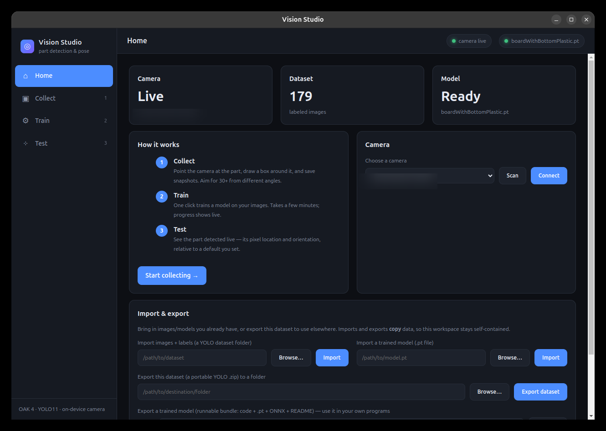
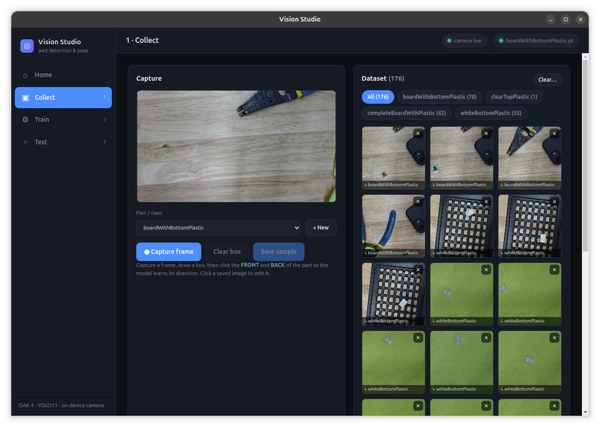
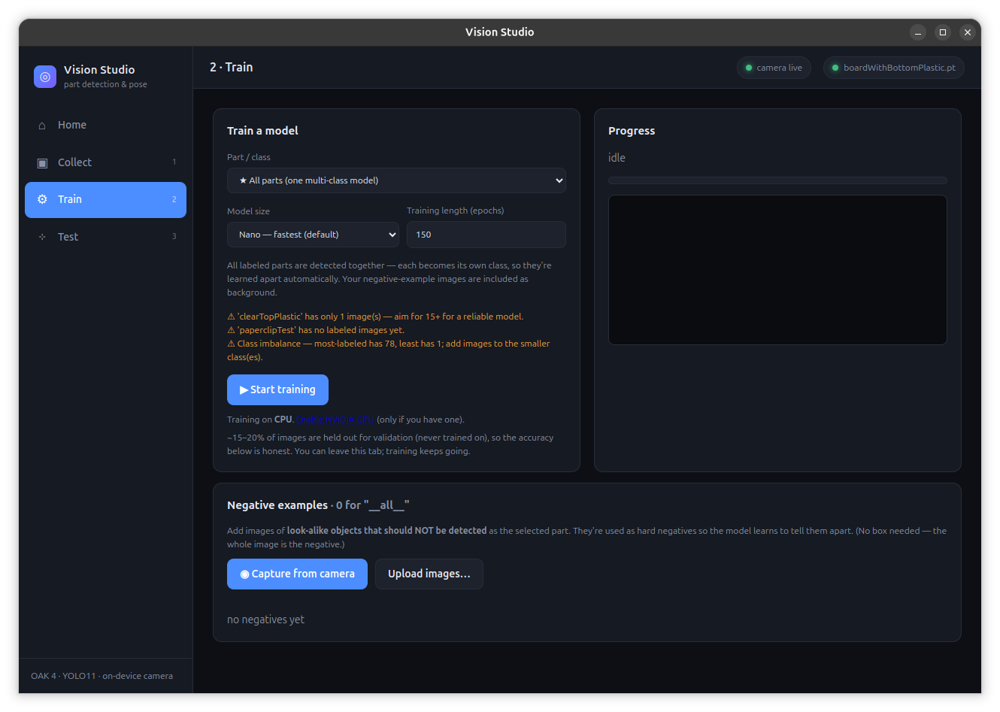
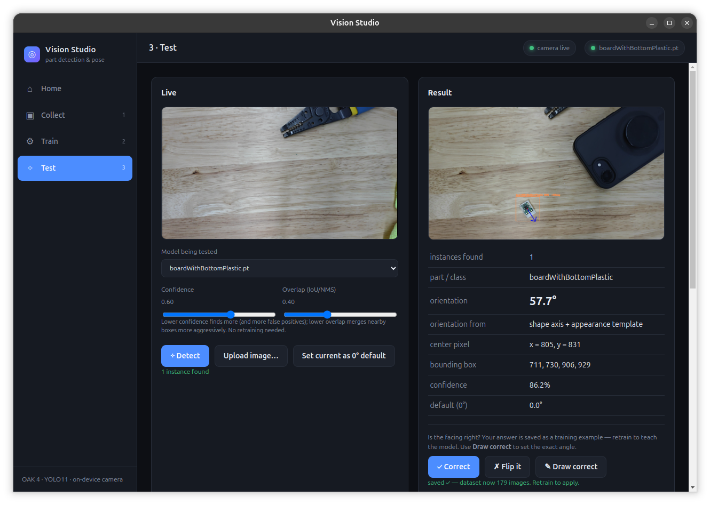

# Vision Studio

A general-purpose app to teach a camera to **find your parts** in an image —
**every instance**, with **where each is** (pixel location) and **which way it
faces** (orientation) — no coding required. Point a camera at your part, label a
few snapshots, click **Train**, test it live, and **export the model** (PyTorch
and ONNX) to use in your own programs.

It is **not tuned to any specific part** — it learns whatever you label.

It bundles three things into one app:

1. **Collect** — capture and label images of your part(s) from the camera.
2. **Train** — build a detector from those images (one click), with optional
   negative examples to reject look-alikes.
3. **Test** — see all instances detected live, with position and orientation;
   correct any wrong-facing arrows; then **export** the model bundle.

## Screenshots

| Home | Collect |
| --- | --- |
|  |  |
| **Train** | **Test** |
|  |  |

## Why you can trust the results
- **Honest accuracy:** ~15–20% of your images are **held out for validation
  only** (never trained on), so the reported **mAP50 / mAP50-95** is real.
- **See it for yourself:** after training, the app shows held-out validation
  images **with the model's predicted boxes**.
- **Dataset health checks** before training: warns about too-few images per
  class, class imbalance, and unlabeled images.
- **Tune without retraining:** confidence and overlap (IoU/NMS) sliders in Test.
- **Model size** (n/s/m) selectable before training; **GPU auto-used** if an
  NVIDIA card is present (else CPU).

## Orientation (part-agnostic)
Orientation is read from the part itself, in two stages so it works for any
shape: (1) the **axis** from the part's silhouette, and (2) the **facing
direction** from internal appearance — an ensemble of an appearance template and
ORB feature matching against a reference learned from your front/back labels.
No per-part code.

## Export your model
**Home → Export the trained model** writes a portable `.zip`: `model.pt`,
`model.onnx` (runs in any language via onnxruntime), `classes.txt`, the
orientation reference, and a `USAGE.md` with copy-paste inference snippets.

---

No GPU needed — training and detection run on the CPU. A camera is optional
(OAK 4 / USB webcam / IP-RTSP, switchable on the Home screen) — you can also
train and test on uploaded image files with no camera at all.

## Install

### For most people — download and run (no terminal)
Download the installer for your system and open it:
- **Windows:** `Vision.Studio.Setup.*.exe`
- **macOS:** `Vision.Studio-*.dmg` (Apple Silicon)
- **Linux (recommended):** `VisionStudio-*.deb` — install with
  `sudo dpkg -i VisionStudio-*.deb` (or double-click it). Runs sandboxed with no
  extra flags.
- **Linux (portable):** `VisionStudio-*.AppImage` — `chmod +x` then run. On
  Ubuntu 24.04+ the AppImage must be started with `--no-sandbox`
  (`./VisionStudio-*.AppImage --no-sandbox`) because an AppImage can't configure
  the Chromium sandbox itself; the `.deb` doesn't have this caveat.

On **first launch** a one-time **setup screen** appears: it verifies the bundled
detection engine, downloads the base model, shows progress, and reports any
problem clearly. After that it goes straight to the app. (Installers bundle their
own Python — nothing else to install.)

### From source (developers/contributors)
```bash
cd vision-studio
./scripts/setup.sh        # one-time: builds the Python env + installs everything
./scripts/run.sh          # desktop app   (or ./scripts/run.sh --web for browser)
```
The first desktop launch also shows the setup screen if the environment isn't
ready yet.

## Building the installers (maintainers)
Producing a download requires a prebuilt, bundled Python runtime, then
electron-builder. Run **on each target OS** (a Python env can't be cross-built):
```bash
npm install
./scripts/bundle-python.sh   # vendors a standalone Python + CPU-only PyTorch into ./pyenv
npm run dist                 # outputs installers/ (AppImage / dmg / exe)
```
See `docs/PACKAGING.md` for details and CI notes.

---

## Using it

**Home** shows your camera, dataset, and model status. Set your camera's IP here
if it isn't found automatically.

### 1 · Collect
- Point the camera at your part.
- Click **Capture frame** to freeze the current view.
- **Drag a box** around the part.
- Pick (or **+ New**) the part's name, then **Save sample**.
- Repeat from different angles and positions. **30+ images** gives a solid
  model; more is better. Saved images appear in the gallery (delete any bad
  ones with the ×).

> **Already have images or a model?** On the **Home** screen, *Import & export*
> brings in a YOLO dataset folder (images + labels) or a trained `.pt` model
> (use **Browse…** in the desktop app, or type a path). It can also **export**
> your dataset as a portable YOLO `.zip` (images + labels + `data.yaml`) to use
> in other tools. Import/export **copy** data, so this workspace stays separate
> from wherever the originals live.

### 2 · Train
- Pick the part and click **Start training**. A progress bar and live accuracy
  (mAP) show how it's going. It takes a few minutes on CPU.
- To detect **several parts with one model**, choose **★ All parts (one
  multi-class model)** in the dropdown — it trains a single detector over every
  labeled class.
- When it finishes, the new model becomes active automatically. You can keep
  using the app while it trains.

### 3 · Test
- Click **Detect** to find **every instance of every class** in the live view
  (or **Upload image…** to test a saved photo). Boxes are color-coded per class;
  the panel lists each detection with its class name, confidence, and
  orientation.
- **Set current as 0° default** records the part's current angle as "zero," so
  orientation is reported relative to a pose you choose.

---

## Where your data lives

Everything is kept inside the app folder under `data/`:

- `data/dataset/` — your labeled images and labels (standard YOLO format)
- `data/models/` — trained models (`<part>.pt`)
- `data/config.json` — settings (camera IP, calibrated 0°, active model)

Delete `data/` to start fresh; back it up to keep your work.

## Troubleshooting

- **Camera shows "off" or "error"** — check the IP on the Home screen and click
  **Reconnect**. The OAK is single-client: close the Luxonis **OAK Viewer** app
  if it's open. See `docs/CAMERA.md`.
- **"No model yet" in Test** — collect images and train first.
- **Detection finds nothing** — lower the lighting glare, make sure the part is
  fully in view, and that you trained on similar-looking images.

## More docs

- `docs/ARCHITECTURE.md` — how the app is built (for developers)
- `docs/CAMERA.md` — OAK 4 connection details
- `docs/ROADMAP.md` — what's done and what's next (e.g. one-click installers)
